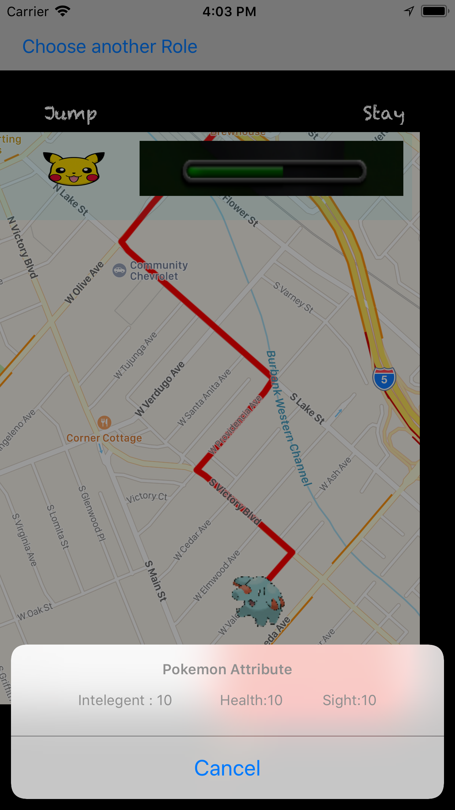

# iOSPokemonSingleProject
Single final project in iOS track of Coding-Dojo. It is a game about Pokemon travel around the world. Main technoloy is mapkitView,  cocoapod, CoreDate,Stripe and so forth

 
<h1> Opening APP Page: </h1>

<h1> Select Role : </h1>

<h1> game start : </h1>

<h1> gaming : </h1>

<h1> filp treasure box  : </h1>

